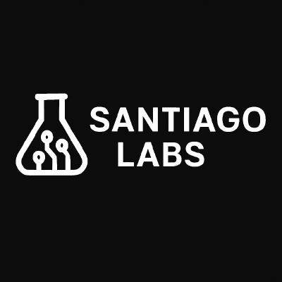

  

<h1 align="center">Santiago Labs</h1>

  Laboratório de projetos, estudos e desenvolvimento backend em Java, Spring e tecnologias modernas.

---

## 🚀 Sobre a Santiago Labs
A Santiago Labs é o espaço onde organizo meus estudos, projetos experimentais e aplicações completas para portfólio.  
Aqui ficam armazenados:

- Projetos reais (portfólio)  
- Projetos de aprendizagem estruturada  
- Estudos guiados (Spring Security, JPA, MongoDB, APIs, Microservices…)  
- Repositórios de testes e protótipos  

---

## 📁 Estrutura da Organização

### **🔷 Portfolio**
Projetos completos e profissionais:

- **App Barbearia (SoluFlow Barbeiro)** – Agendamentos, integração com IA e WhatsApp  
- **Spring MongoDB – Rede Social de Exemplo**  
- **Workshop Spring JPA (SQL)**  

---

### **🔶 Learning (Aprendizagem)**
Repositórios dedicados a estudos:

- Spring Security
- Spring Boot básico
- JPA / Hibernate
- MongoDB / Document Databases
- Clean Architecture

---

### **🔸 Sandbox (Testes)**
Projetos rápidos, experimentos e provas de conceito:

- DAO JDBC
- Exceptions em Java
- Testes de API
- Mini aplicações de estudo

---

## 🛠 Stack principal
Java · Spring Boot · Spring Security · JPA/Hibernate · MongoDB · Docker · Maven  
GitHub · Git · Rest APIs · IntelliJ IDEA  

---

## 🌐 Contato
**Mauricio Santiago**  
Desenvolvedor Backend | Java & Spring  
